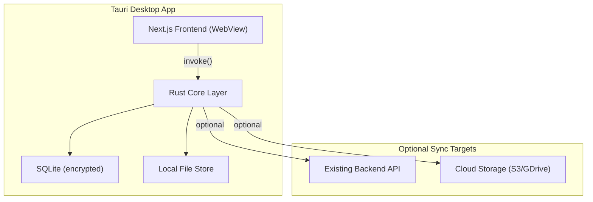

# Tauri Desktop App - Offline-First with Optional Sync

## Current Architecture Summary

The project is a pnpm monorepo with:
- **Frontend**: Next.js 16 app ([apps/web](apps/web)) with Zustand state, Radix UI, Tailwind, Firebase Auth
- **Backend**: FastAPI + MongoDB ([apps/backend](apps/backend)) storing user data in collections (passwords, notes, bookmarks, tasks, snippets, env vars, API client data, S3 connections, SQL connections, NoSQL connections)
- **Auth**: Firebase Auth on frontend, JWT session cookies for backend API
- **Encryption**: Client-side AES-256-GCM via Web Crypto API (PBKDF2 key derivation from master password). Encrypted data stored server-side; server never sees plaintext
- **Key Storage**: CryptoKey persisted in IndexedDB (browser)

## Architecture for Tauri Desktop App



## Key Design Decisions

### 1. Offline-First Data Layer (Rust + SQLite)

Replace backend API calls with a local Rust data layer using **SQLCipher** (encrypted SQLite):

- **Confidential data** (passwords, env vars, S3 credentials, SQL/NoSQL connection strings): Encrypted locally with AES-256-GCM using the same Web Crypto derivation scheme, stored in SQLCipher DB
- **Non-confidential data** (bookmarks, tasks, notes, code snippets, API client history): Stored in plain SQLite tables locally
- **S3 Drive file cache**: Stored in app's local file system directory

The Rust layer exposes Tauri commands that mirror the existing backend API interface, so the frontend's API layer can swap between `fetch()` (web) and `invoke()` (Tauri) with minimal changes.

### 2. Frontend Adaptation Strategy

Create a shared **platform adapter** layer:

```typescript
// apps/web/src/lib/platform.ts
export const platform = {
  isDesktop: () => Boolean(window.__TAURI__),
  isWeb: () => !window.__TAURI__,
}

// apps/web/src/lib/api-adapter.ts  
export async function apiCall(endpoint, options) {
  if (platform.isDesktop()) {
    return invoke('api_call', { endpoint, ...options })
  }
  return backendFetch(endpoint, options)
}
```

This keeps the existing web app working as-is while the Tauri build routes calls to the local Rust backend.

### 3. Auth in Desktop Mode

- **No Firebase dependency in desktop mode** - user sets a local master password on first launch
- The master password derives the SQLCipher encryption key (same PBKDF2 scheme already used)
- Optional: link a remote account for sync (Firebase auth or username/password to the existing backend)

### 4. Sync Architecture

Two sync modes, per-app configurable:

| Data Type | Sync to Backend | Sync to Cloud |
|-----------|----------------|---------------|
| Passwords | Encrypted blobs synced | Encrypted export file |
| Notes | Full sync | JSON export |
| Bookmarks | Full sync | JSON export |
| Tasks | Full sync | JSON export |
| Env vars | Encrypted blobs synced | Encrypted export file |
| S3/SQL/NoSQL connections | Encrypted blobs synced | Encrypted export file |

Sync protocol:
- **Last-write-wins** with `updatedAt` timestamps (already present on all records)
- Each record gets a `syncStatus` field: `local_only | synced | pending_push | conflict`
- Background sync worker in Rust polls/pushes on configurable interval
- Conflict resolution: show user a diff and let them choose

### 5. Monorepo Structure Changes

```
mydevtools-monorepo/
├── apps/
│   ├── web/                    # Existing Next.js web app (unchanged)
│   ├── backend/                # Existing FastAPI backend (unchanged)
│   └── desktop/                # NEW: Tauri app shell
│       ├── src-tauri/
│       │   ├── Cargo.toml
│       │   ├── tauri.conf.json
│       │   ├── src/
│       │   │   ├── main.rs
│       │   │   ├── commands/       # Tauri invoke handlers
│       │   │   │   ├── mod.rs
│       │   │   │   ├── passwords.rs
│       │   │   │   ├── notes.rs
│       │   │   │   ├── bookmarks.rs
│       │   │   │   ├── tasks.rs
│       │   │   │   ├── env_manager.rs
│       │   │   │   ├── snippets.rs
│       │   │   │   ├── api_client.rs
│       │   │   │   ├── s3_drive.rs
│       │   │   │   ├── sql_client.rs
│       │   │   │   └── nosql.rs
│       │   │   ├── db/             # SQLite/SQLCipher layer
│       │   │   │   ├── mod.rs
│       │   │   │   ├── migrations.rs
│       │   │   │   └── schema.rs
│       │   │   ├── sync/           # Optional sync engine
│       │   │   │   ├── mod.rs
│       │   │   │   ├── backend_sync.rs
│       │   │   │   └── cloud_sync.rs
│       │   │   ├── crypto.rs       # Encryption helpers
│       │   │   └── config.rs       # App configuration
│       │   └── icons/
│       ├── src/                    # Frontend entry (loads Next.js build)
│       │   └── index.html
│       └── package.json
├── packages/
│   └── shared-types/           # NEW: Shared TypeScript types
│       ├── package.json
│       └── src/
│           └── index.ts
└── pnpm-workspace.yaml        # Updated to include packages/*
```

### 6. Tauri Configuration

- **Tauri v2** (latest stable, Rust-based, better security model)
- Frontend: **Static export of Next.js** (`next export` or `output: 'export'`) embedded in Tauri
- Dev mode: Tauri points to `http://localhost:3000` (Next.js dev server)
- Permissions: filesystem (app data dir), network (for sync), shell (none)

### 7. Data Migration Path

For users of the web app who want to move to desktop:
1. Export all data from web app (encrypted JSON bundle)
2. Import into desktop app (decrypted with master password, re-encrypted locally)
3. Or: enable sync and let background sync pull all data

## Implementation Phases

### Phase 1: Tauri Scaffold + Local Storage (Core)
- Initialize Tauri v2 project in `apps/desktop`
- Set up SQLCipher database with schema matching all collections
- Implement master password / key derivation in Rust
- Create platform adapter in frontend (`isDesktop` detection)
- Wire up the first module (passwords) end-to-end locally

### Phase 2: All Modules Offline
- Implement all Tauri commands for: notes, bookmarks, tasks, snippets, env manager, API client, S3 drive connections, SQL/NoSQL connections
- Frontend adapter for all API calls
- Local file storage for S3 drive cache

### Phase 3: Sync Engine
- Backend sync: authenticate with existing backend, push/pull encrypted records
- Cloud sync: export/import encrypted bundles to S3 or local file
- Per-app sync toggle in settings UI
- Conflict resolution UI

### Phase 4: Polish + Distribution
- App icons and branding
- Auto-updater (Tauri built-in)
- macOS notarization, Windows code signing
- Linux AppImage/deb/rpm
- CI/CD for multi-platform builds (GitHub Actions)

## Key Files to Modify

- [pnpm-workspace.yaml](pnpm-workspace.yaml) - add `packages/*` and `apps/desktop`
- [apps/web/src/lib/backend-auth.ts](apps/web/src/lib/backend-auth.ts) - add desktop adapter branching
- [apps/web/next.config.ts](apps/web/next.config.ts) - add static export config for Tauri builds
- [apps/web/src/utils/useAuth.tsx](apps/web/src/utils/useAuth.tsx) - bypass Firebase in desktop mode
- [apps/web/src/lib/key-storage.ts](apps/web/src/lib/key-storage.ts) - use Tauri secure storage in desktop mode

## Technology Choices

- **Tauri v2**: Latest, better permission model, smaller binary than Electron
- **SQLCipher** (via `rusqlite` with `bundled-sqlcipher` feature): Encrypted SQLite at rest
- **serde/serde_json**: Rust serialization matching existing JSON schemas
- **reqwest**: HTTP client for sync with backend API
- **tauri-plugin-store**: Secure key-value store for non-DB settings
- **tauri-plugin-fs**: File system access for S3 drive cache
